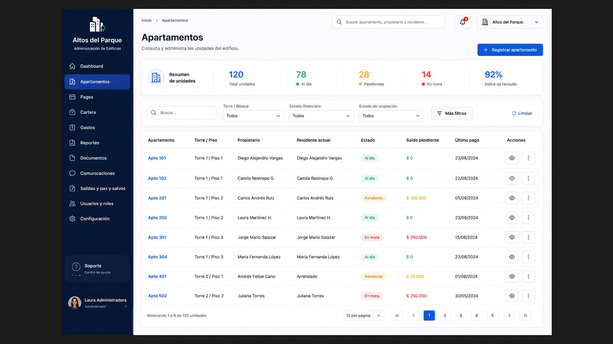
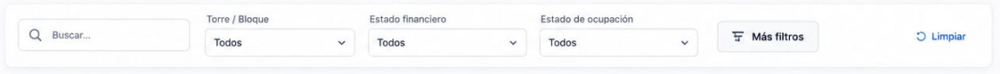
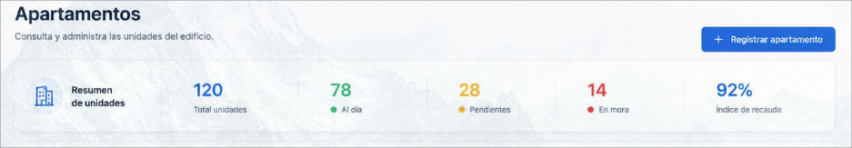

# Strategic Dashboard Breakdown

## Table of Contents
---

# 1. Objective

This directory contains the reference visual prototype for the **main apartment management interface**.

These images represent an approximation of how the system should look after development and will serve as a guide for tasks created within **GitHub Projects**.

The goal of this documentation is to enable any developer to understand:

* What each section of the interface represents.
* Which components need to be developed.
* Which elements should be omitted.
* Which information will be dynamic.
* The expected behavior of each component.
* Developer responsibilities.
* Responsibilities to be handled later during integration.

> [!IMPORTANT]
> The images are visual references and do not necessarily represent the system's final behavior.
>
> The written instructions in this document take precedence over any elements shown in the prototypes.

---

# 2. Complete Prototype



The apartments interface is essential to our client's administrative process; furthermore, it serves as the central hub for managing apartment-related tasks, such as creating, viewing, deleting, and updating data.

---

## 3. Component Principles

Components should be built with a primary focus on:

### Reusability

A component should not be designed exclusively for a single value when it can represent different data via parameters.

### Independence

A visual component should not need to know how the information it displays is obtained.

### Configuration via Props

Whenever possible, reusable components should receive the information needed for rendering via `props`.

### Separation of Concerns

The component's primary responsibility will be to **render information and visual behavior**.

Data fetching, transformation, and integration will be handled in higher-level layers where appropriate.

---

# 4. Filters Component




To understand this component and how we will work with it, let's look at it this way:

By examining the image, we can identify a small section within each component that contains a title:


...and a selection input:


This pattern:


...will be repeated multiple times throughout the prototype; therefore, we need a way to automatically pass in both the title and the list to be rendered in the selection input.

---

Clicking the `Aplicar` button triggers the proposed filters; this specific action must also execute the function that queries the database.

The `Limpiar` button must be functional, resetting all inputs to `Todos` and thereby removing the filters. The aforementioned function must be executed again, but this time with a parameter indicating that the filters have been cleared, ensuring the query returns all records.

# 5. Navigation Component


This section will be handled exclusively by reviewers or developers—and only if we are in the backend stage.

To achieve the prototype's objective, it is necessary to implement only what is shown in the image; do not add extra logic—include only what appears on the screen.

Remember to make the navigation component flexible.

> [!IMPORTANT]
> It does not need to be reusable.
> It will be designed solely as a frontend; everything will be static.

# 6. Summary Component



Everything must look exactly as it does in the image; however, the numerical values ​​representing the statistics must be passed via `props` or variables when querying the database.

The "Register Apartment" button should not be functional yet; simply style its active and hover states.

# 7. Reuse table with test data

## Objective:

We have a fully reusable table component created within the dashboard component; we need to take that component and adapt it to what we are currently working on—namely, the general table.

## Contextualization

The table component in question has certain properties that can be passed to it dynamically to facilitate its rendering; among them is the following code:

```javascript
import dataTable from './alguna/ruta/data_table.json'

function DashBoard() {
  const columns = []

  for (let element of Object.keys(dataTable[0])){
    columns.push({
      key: element,
      header: element.replace(/_/g, " ").replace(/\b\w/g, (c) => c.toUpperCase()),
    })
  }

  columns.map((object) => {
    if (object.key === 'estado') {
      object.render = (value) => (
        <span 
          className={`
            ${
              value === 'Al día' 
              ? 'uptodate'
              : value === "Pendiente"
                ? 'pending'
                : 'delay'}`}>
          {value}
        </span>
      )
    }
  })
  
  return (
    <>
      <TableComponent icon={<Building2 />} title={"Apartamentos"} columns={columns}/>
    </>
  )
}

export default DashBoard
```

This latter code is flexible enough to be reused by passing in completely different styles to achieve the look required for the specific use case; furthermore, the received data can easily be augmented with additional elements to create the "Actions" column shown in the reference image.

For more information, you can consult the table documentation at the following link: [Table Component Documentation](https://github.com/StartupName/admin-software/blob/main/docs/prototype/dashboard/README.md#8-transactions-table-component)

Keep in mind that the data to be read from the table must be dummy data representing the actual database records—as simple as a list of objects in JSON format.