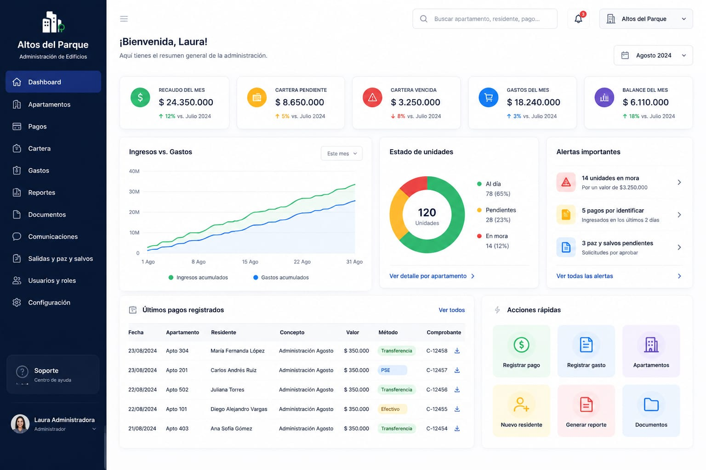
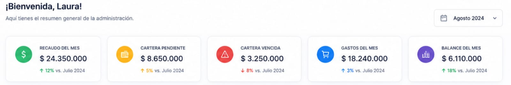
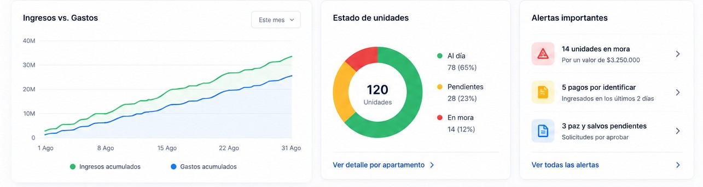
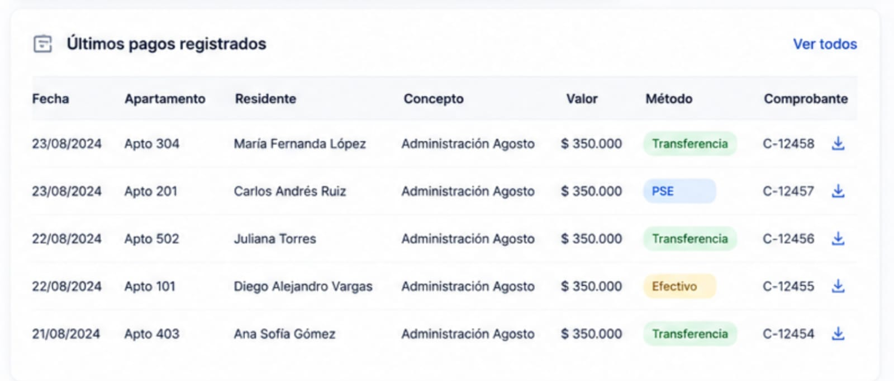
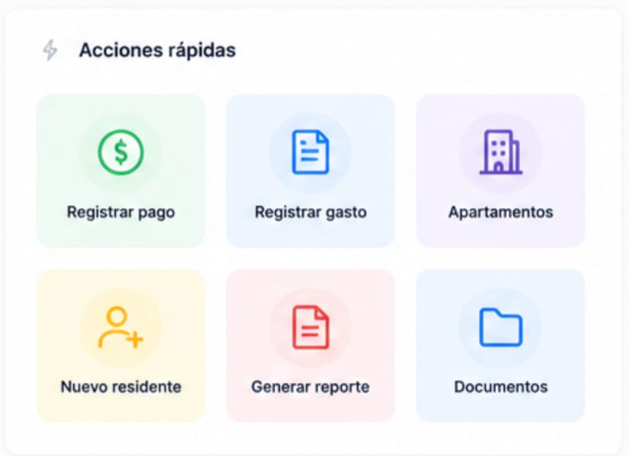

# Strategic Dashboard Breakdown

## Table of Contents

- [Strategic Dashboard Breakdown](#strategic-dashboard-breakdown)
  - [Table of Contents](#table-of-contents)
- [1. Objective](#1-objective)
- [2. Complete Prototype](#2-complete-prototype)
- [3. Development Scope](#3-development-scope)
  - [3.1. Responsibilities Reserved for Integration and Review](#31-responsibilities-reserved-for-integration-and-review)
- [4. Component Principles](#4-component-principles)
    - [Reusability](#reusability)
    - [Independence](#independence)
    - [Configuration via Props](#configuration-via-props)
    - [Separation of Concerns](#separation-of-concerns)
- [5. Top Navigation Component](#5-top-navigation-component)
  - [5.1. Elements Shown in the Prototype That Should NOT Be Developed](#51-elements-shown-in-the-prototype-that-should-not-be-developed)
  - [5.2. Organization Name](#52-organization-name)
  - [5.3. Potential Components](#53-potential-components)
- [6. Information Cards Component](#6-information-cards-component)
  - [6.1. Required Indicators](#61-required-indicators)
  - [6.2. Reusable Component](#62-reusable-component)
  - [6.3. Minimum Card Information](#63-minimum-card-information)
  - [6.4. Flexibility](#64-flexibility)
  - [6.5. Temporary Data](#65-temporary-data)
  - [6.6. Restrictions](#66-restrictions)
- [7. Charts Component](#7-charts-component)
  - [7.1. Initially Planned Charts](#71-initially-planned-charts)
  - [7.2. Apartment Status](#72-apartment-status)
  - [7.3. Third Panel](#73-third-panel)
  - [7.4. Data](#74-data)
- [8. Transactions Table Component](#8-transactions-table-component)
  - [8.1. Objective](#81-objective)
  - [8.2. Reusable Design](#82-reusable-design)
- [9. Quick Actions Component](#9-quick-actions-component)
  - [9.1. Actions to Be Included](#91-actions-to-be-included)
  - [9.2. Reusable Component](#92-reusable-component)
  - [9.3. Navigation](#93-navigation)
- [10. Responsive Design](#10-responsive-design)
- [11. Visual States](#11-visual-states)
- [12. Mock Data During Development](#12-mock-data-during-development)
- [13. Relationship Between This Document and GitHub Projects](#13-relationship-between-this-document-and-github-projects)
- [14. Development Rule](#14-development-rule)
- [15. Integration Team Responsibilities](#15-integration-team-responsibilities)
- [16. Learning Objective](#16-learning-objective)
- [17. Expected Outcome](#17-expected-outcome)

---

# 1. Objective

This directory contains the reference visual prototype for the **software's main Dashboard**.

These images represent an approximation of how the system should look after development and will serve as a guide for tasks created within **GitHub Projects**.

The goal of this documentation is to enable any developer to understand:

* What each section of the interface represents.
* Which components need to be developed.
* Which elements should be omitted.
* Which information will be dynamic.
* The expected behavior of each component.
* Developer responsibilities.
* Responsibilities to be handled later during integration.

> [!IMPORTANT]
> The images are visual references and do not necessarily represent the system's final behavior.
>
> The written instructions in this document take precedence over any elements shown in the prototypes.

---

# 2. Complete Prototype



The Dashboard is the system's main interface.

Its purpose is to provide administration with an overview of the building's current status and allow quick access to frequently used operations.

From this interface, users can view financial indicators, visualize data via charts, check recent transactions, and access common administrative actions.

The Dashboard is divided into different components that will be developed independently.

---

# 3. Development Scope

The developers assigned to the components described in this document will primarily be responsible for their:

* Visual structure.
* Layout.
* Styles.
* Basic behavior.
* Reusability.
* Adaptability.
* Data reception and rendering via `props`, where applicable.

Unless a task explicitly states otherwise, the component developer is not responsible for implementing full system integration. **However, individual initiative is certainly valued; therefore, if your solution implements any of the previously restricted features—and does so correctly—there is no reason for it to be rejected, and it will be considered a valuable contribution.**

## 3.1. Responsibilities Reserved for Integration and Review

The following responsibilities will be handled subsequently by the developers in charge of architecture, integration, and review:

* Backend connection.
* HTTP requests.
* Fetching data from the API.
* Authentication and authorization.
* Global application state.
* Final page-to-page navigation.
* Component integration.
* Architectural decisions.
* Creation or modification of core project structures.
* Final handling of data from the database.

> [!NOTE]
> The frontend does not query the database directly.
>
> Components will receive data that is ultimately fetched from the backend through the corresponding integration.

---

# 4. Component Principles

Components should be built with a primary focus on:

### Reusability

A component should not be designed exclusively for a single value when it can represent different data via parameters.

### Independence

A visual component should not need to know how the information it displays is obtained.

### Configuration via Props

Whenever possible, reusable components should receive the information needed for rendering via `props`.

For example:

```jsx
<MetricCard
  title="Monthly Collection"
  value="$12,450,000"
  icon={WalletIcon}
/>
```

The `MetricCard` component does not need to know where those values come from.

### Separation of Concerns

The component's primary responsibility will be to **render information and visual behavior**.

Data fetching, transformation, and integration will be handled in higher-level layers where appropriate.

---

# 5. Top Navigation Component


This component corresponds to the Dashboard's top navigation bar.

It will provide access to global tools such as search, notifications, and identification of the currently selected organization or property.

## 5.1. Elements Shown in the Prototype That Should NOT Be Developed

The three-line menu located on the left side of the visual reference **must not be implemented**.

Side navigation will be managed via the system's corresponding component.

## 5.2. Organization Name

The box where the following currently appears:

`Altos del Parque`

must not contain that value as a hardcoded string.

The name must be dynamic and reflect the relevant organization, building, or property.

During visual development, the following may be used temporarily:

```text
Altos del Parque
```

as test data.

Subsequently, this value will be provided by the system during integration.

## 5.3. Potential Components

This section may be broken down into components such as:

* `Topbar`
* `GlobalSearch`
* `NotificationButton`
* `OrganizationSelector`

The final breakdown will be specified in the corresponding tasks.

---

# 6. Information Cards Component



This section displays the Dashboard's key administrative and financial indicators.

The values shown in the prototype are merely examples.

The final data will be dynamic.

## 6.1. Required Indicators

Initially, the following indicators must be included:

* Total monthly collection.
* Total annual collection.
* Total resident debt.
* Monthly expenses.

## 6.2. Reusable Component

Four completely different components should not be developed to represent each indicator.

A reusable component must be created—for example:

```text
MetricCard
```

—capable of accepting different data.

For example:

```jsx
<MetricCard
  title="Monthly collection"
  value="$12,450,000"
  icon={WalletIcon}
/>
```

and subsequently:

```jsx
<MetricCard
  title="Monthly expenses"
  value="$4,850,000"
  icon={ExpenseIcon}
/>
```

Both cases must use the same component.

## 6.3. Minimum Card Information

Each card must be able to display, at a minimum:

* An icon.
* A user-friendly title.
* A primary value.

The visual reference may be used as a guide for establishing hierarchy, spacing, and layout.

## 6.4. Flexibility

The container responsible for displaying the cards must be able to adapt to varying numbers of indicators.

For example, it must correctly display:

* 2 cards.
* 3 cards.
* 4 cards.
* Additional indicators if needed later.

The number of cards must not rely on duplicated visual code.

## 6.5. Temporary Data

During development, test values such as the following may be used:

```text
Monthly revenue: $12,450,000
Annual revenue: $108,350,000
General debt: $8,200,000
Monthly expenses: $4,850,000
```

These values exist solely for visualizing and testing the component.

They should not be considered definitive information.

## 6.6. Restrictions

The component must not:

* Directly query an API.
* Query a database.
* Contain definitive financial values hardcoded within the component.
* Depend on the Dashboard to render.
* Implement authentication logic.

---

# 7. Charts Component



This section displays administrative information using graphical elements.

The data currently shown are for visual reference only.

## 7.1. Initially Planned Charts

The Dashboard must initially include information regarding:

1. Collections.
2. Apartment status.

The specific information, data structure, and backend connection will be defined during integration.

## 7.2. Apartment Status

The prototype displays the title:

`Unit status`

This text must be changed to:

`Apartment status`

Additionally, the option:

`View details by apartment`

**must not be developed**, as it is considered unnecessary for this section of the Dashboard.

## 7.3. Third Panel

The third panel shown in the visual reference **must not be developed at this time**.

The system will not initially utilize the alert model depicted in the prototype.

The space may be used later if the team identifies another indicator that adds administrative value.

Selecting such an indicator is the responsibility of the product team, **not the individual component developer**.

## 7.4. Data

Mock data may be used during visual development.

The connection to real data will be implemented at a later stage.

---

# 8. Transactions Table Component



This section will display recent financial transactions carried out by the administration.

> [!IMPORTANT]
> The table does NOT represent exclusively the latest payments recorded by residents.

It must represent transactions involving funds within the administration.

For example:

* Income.
* Payments received.
* Expenses.
* Outflows.
* Other financial transactions defined at a later stage.

## 8.1. Objective

The goal is to allow the administrator to quickly view recent financial transactions without needing to immediately navigate to another module.

## 8.2. Reusable Design

The table should be built ensuring that:

* Rows can be generated dynamically.
* Information can be received via external data.
* There is no fixed number of records hardcoded into the component.
* Headers are clear.
* Monetary values are easy to identify.

The final column definitions will be specified in the corresponding task before the component is developed.

---

# 9. Quick Actions Component



This section provides quick access to some of the system's most frequent operations.

## 9.1. Actions to Be Included

Initially, only the following should be included:

* Record payment.
* Record expense.
* Apartments.

The other elements shown in the visual reference **must not be developed**.

## 9.2. Reusable Component

It is recommended to create a reusable component for each action, for example:

```text
QuickActionCard
```

capable of accepting:

* Icon.
* Title.

Conceptual example:

```jsx
<QuickActionCard
  title="Record payment"
  icon={PaymentIcon}
/>
```

## 9.3. Navigation

The button:

`Apartments`

must subsequently navigate to the main page of the apartments module.

It must not navigate directly to a specific list.

> [!IMPORTANT]
> The final implementation of navigation and routing will be the responsibility of the reviewers/integrators.
>
> The developer assigned to the component should only implement the visual behavior or callback requested in their task.
>
> That said, if you feel capable of correctly implementing the navigation, you are welcome to do so, and it will be considered a valuable contribution.

---

# 10. Responsive Design

All components must be built with different screen sizes in mind.

The prototype primarily represents the desktop version of the application.

At a minimum, components must avoid:

* Unnecessary horizontal overflow.
* Overlapping text.
* Content extending outside its containers.
* Clipped cards.
* Inaccessible buttons.
* Overlapping visual elements.
* Completely rigid sizes that prevent adaptation.

Individual tasks are not necessarily required to implement the system's full mobile experience on their own, unless the corresponding Issue/Task specifies otherwise.

---

# 11. Visual States

Where applicable to the component being developed, states such as the following must be considered:

* Normal.
* `hover`.
* `focus`.
* `disabled`.
* No data.
* Long content.
* Descriptive title.
* Large numerical values.

The corresponding task will indicate which of these states are mandatory for each component.

---

# 12. Mock Data During Development

Developers may use mock data to correctly visualize their components.

Example:

```js
const dashboardData = [
  {
    title: "Monthly revenue",
    value: "$12,450,000"
  },
  {
    title: "Annual revenue",
    value: "$108,350,000"
  },
  {
    title: "Total debt",
    value: "$8,200,000"
  },
  {
    title: "Monthly expenses",
    value: "$4,850,000"
  }
];
```

This data serves solely as a development tool.

The use of mock data **does not mean it should remain hardcoded within the final component**.

---

# 13. Relationship Between This Document and GitHub Projects

This document **does not represent a single development task**.

The Dashboard will be broken down into different components, and the work for each will be managed via tasks within GitHub Projects.

The expected workflow is:

```text
Prototype
    ↓
Dashboard documentation
    ↓
Component identification
    ↓
GitHub Issue/Task
    ↓
Developer assignment
    ↓
Branch creation
    ↓
Development
    ↓
Commit
    ↓
Push
    ↓
Pull Request
    ↓
Ready for Review
    ↓
Review
    ↓
Integration
    ↓
Merge
```
---

# 14. Development Rule

> [!CAUTION]
> The appearance of a component in this documentation **does not mean the developer is authorized to implement it**.

Only components that have been created and assigned via a task in GitHub Projects should be developed.

This allows for maintaining control over:

* Priorities.
* Dependencies.
* Architecture.
* Responsibilities.
* Assignments.
* Reviews.
* Overall development status.

---

# 15. Integration Team Responsibilities

Developers responsible for architecture, integration, and review will primarily handle the following:

* Creating the necessary structure prior to specific tasks.
* Defining the placement of each component.
* Establishing key contracts between components.
* Integrating independently developed components.
* Connecting them with real data.
* Implementing navigation.
* Connecting APIs.
* Handling authentication and permissions.
* Reviewing Pull Requests.
* Requesting changes.
* Resolving architectural conflicts.
* Approving implementations.
* Performing or authorizing merges into protected branches.

---

# 16. Learning Objective

Developing these components is also part of the team's learning process.

Tasks should allow for progressive advancement from simple components to more complex structures.

A developer might start by working on concepts such as:

```text
HTML
  ↓
CSS
  ↓
Functions
  ↓
JSX
  ↓
Components
  ↓
Props
  ↓
Events
  ↓
List rendering
  ↓
Component composition
  ↓
Local state
  ↓
More complex components – Even if restricted to specific developers.
```

The goal is not merely to complete the Dashboard.

The aim is also for developers to progressively understand how a real React application is built while contributing usable components to the project.

---

# 17. Expected Outcome

Upon completion of the tasks associated with this module, there should be independent, reusable components available that can subsequently be integrated to build the complete Dashboard.

Conceptually:

```text
Dashboard
│
├── Topbar
│   ├── GlobalSearch
│   ├── NotificationButton
│   └── OrganizationSelector
│
├── MetricsSection
│   └── MetricCard
│
├── ChartsSection
│   ├── RevenueChart
│   └── ApartmentsStatusChart
│
├── RecentMovements
│   └── MovementTable
│
└── QuickActions
    └── QuickActionCard
```

This structure is conceptual.

The final architecture, file names, directory structure, and component relationships will be determined by those responsible for architecture and integration prior to the assignment of the corresponding tasks.
