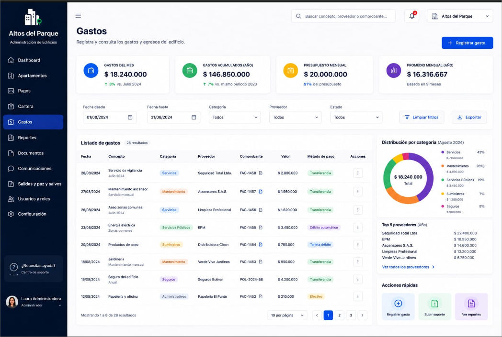

# Strategic Expenses Breakdown

# 1. Objective

This directory contains the reference visual prototype for the **software's main Expenses**.

These images represent an approximation of how the system should look after development and will serve as a guide for tasks created within **GitHub Projects**.

The goal of this documentation is to enable any developer to understand:

* What each section of the interface represents.
* Which components need to be developed.
* Which elements should be omitted.
* Which information will be dynamic.
* The expected behavior of each component.
* Developer responsibilities.
* Responsibilities to be handled later during integration.

> [!IMPORTANT]
> The images are visual references and do not necessarily represent the system's final behavior.
>
> The written instructions in this document take precedence over any elements shown in the prototypes.

---

# 2. Complete Prototype

The Dashboard is divided into different components that will be developed independently.

# 3. Top Suplliers Compoent

Although this component will not be reusable, it is part of the interface.

The component is simple; it must render exactly what is shown on screen, provided the data comes from test data that simulates the actual database data—which will be supplied later.

The "View all suppliers" button must be included, but it should simply trigger an alert saying: "Showing list of suppliers."

The component must be reusable and, as far as possible, flexible enough to adapt to smaller screens.
