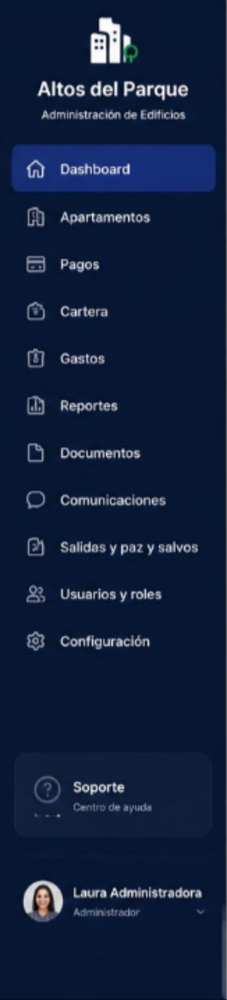
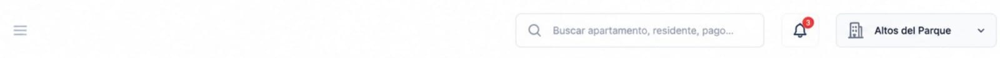

# Principal Menu

## Table of Contents

- [Principal Menu](#principal-menu)
  - [Table of Contents](#table-of-contents)
- [1. Objective](#1-objective)
- [2. SideMenu](#2-sidemenu)
  - [2.1. Navigation Button Specifications](#21-navigation-button-specifications)
  - [2.2. Title and Logo](#22-title-and-logo)
- [3. Modal Menu](#3-modal-menu)
  - [3.1. Additional Considerations](#31-additional-considerations)

---

# 1. Objective

This directory contains the reference visual prototype for the **Principal Menu**.

These images represent an approximation of how the system should look after development and will serve as a guide for tasks created within **GitHub Projects**.

The goal of this documentation is to enable any developer to understand:

* What each section of the interface represents.
* Which components need to be developed.
* Which elements should be omitted.
* Which information will be dynamic.
* Developer responsibilities.
* Responsibilities to be handled later during integration.

> [!IMPORTANT]
> The images are visual references and do not necessarily represent the system's final behavior.
>
> The written instructions in this document take precedence over any elements shown in the prototypes.

---

# 2. SideMenu

This component is the sidebar menu located in the `Menu` section of this prototype. It contains the navigation buttons for accessing the different sections of the system.

## 2.1. Navigation Button Specifications

The `Documents`, `Exits and Clearance Certificates`, `Settings`, and `Support` buttons will not be part of the initial prototype for now, in order to avoid adding unnecessary complexity to the development process.

Each button must be developed considering that `NavLink` from `react-router-dom` is used to redirect the user to the corresponding route. Additionally, `activeClassName` must be used so that the currently active button has a different style from the rest of the buttons.

The button design must match the components shown in the `Menu` section of this prototype.

## 2.2. Title and Logo

The title must be provided dynamically, just like in the  component located in the `Dashboard` section/module of this prototype.

The logo, on the other hand, must be replaced with the company logo, which is loaded directly from the repository's `public` folder.

---

# 3. Modal Menu

This final menu appears immediately after clicking on the profile of the user currently active in the session, which appears as the last button in the `SideMenu`.

The goal is to display the fields exactly as they appear in the image:

## 3.1. Additional Considerations

* No additional functionality or redirection should be added to the button displaying the administrator's name or to any of the buttons located inside the displayed modal.

* Keep in mind that the routes must change accordingly, so the integration with `react-router-dom` must be implemented properly.
