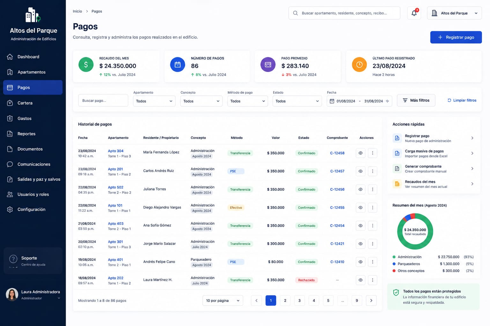
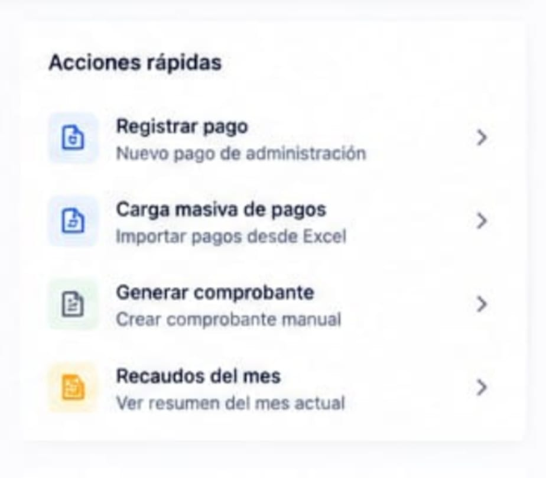

# Strategic Payments Breakdown

# 1. Objective

This directory contains the reference visual prototype for the **main payments       management interface**.

These images represent an approximation of how the system should look after development and will serve as a guide for tasks created within **GitHub Projects**.

The goal of this documentation is to enable any developer to understand:

* What each section of the interface represents.
* Which components need to be developed.
* Which elements should be omitted.
* Which information will be dynamic.
* The expected behavior of each component.
* Developer responsibilities.
* Responsibilities to be handled later during integration.

> [!IMPORTANT]
> The images are visual references and do not necessarily represent the system's final behavior.
>
> The written instructions in this document take precedence over any elements shown in the prototypes.

---

# 2. Complete Prototype

The payments interface is essential to our client's administrative process; furthermore, it serves as the central hub for managing payments-related tasks, such as creating, viewing, deleting, and updating data.

---

## 3. Component Principles

Components should be built with a primary focus on:

### Reusability

A component should not be designed exclusively for a single value when it can represent different data via parameters.

### Independence

A visual component should not need to know how the information it displays is obtained.

### Configuration via Props

Whenever possible, reusable components should receive the information needed for rendering via `props`.

### Separation of Concerns

The component's primary responsibility will be to **render information and visual behavior**.

Data fetching, transformation, and integration will be handled in higher-level layers where appropriate.

---

# 4. Quick actions component

This component must be removed; it will not be part of the desired flow. Instead, replace it with the provided Quick Actions component located on the dashboard. Learn more here: https://github.com/StartupName/admin-software/blob/main/docs/prototype/dashboard/README.md#9-quick-actions-component

These cards need to be rendered so that the information comes from JSON data for testing purposes.
