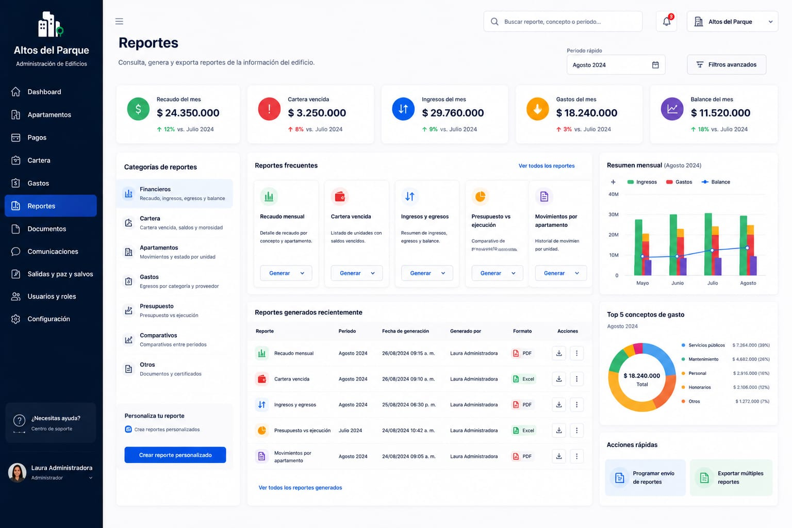
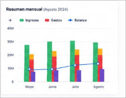

# Strategic Reports Breakdown

# 1. Objective

This directory contains the reference visual prototype for the **main Reports management interface**.

These images represent an approximation of how the system should look after development and will serve as a guide for tasks created within **GitHub Projects**.

The goal of this documentation is to enable any developer to understand:

* What each section of the interface represents.
* Which components need to be developed.
* Which elements should be omitted.
* Which information will be dynamic.
* The expected behavior of each component.
* Developer responsibilities.
* Responsibilities to be handled later during integration.

> [!IMPORTANT]
> The images are visual references and do not necessarily represent the system's final behavior.
>
> The written instructions in this document take precedence over any elements shown in the prototypes.

---

# 2. Complete Prototype

This prototype is important for the main economic analysis of our project.

---

## 3. Component Principles

Components should be built with a primary focus on:

### Reusability

A component should not be designed exclusively for a single value when it can represent different data via parameters.

### Independence

A visual component should not need to know how the information it displays is obtained.

### Configuration via Props

Whenever possible, reusable components should receive the information needed for rendering via `props`.

### Separation of Concerns

The component's primary responsibility will be to **render information and visual behavior**.

Data fetching, transformation, and integration will be handled in higher-level layers where appropriate.

---

# 4. Exclusions

### Frequent Reports component

The information regarding this component will not be taken into account, although its design will be considered for a new implementation: In that space—but using the same format in which the image would appear—reports for each section created on this page will be displayed:

- Apartment Report
- Expense Report
- Payment Report
- Accounts Receivable Report

This information should be developed by applying it to the design already proposed by the prototype,
this information should be developed and applied to the design already proposed by the prototype; each description must be concise and directly address the prototype's requirements.

# 5. Report category

This component must be removed and will not be part of the page's normal flow.

# 6. Monthly Summary

To implement this component, use Recharts—the standard charting library we are currently employing. The data should be sourced directly from a file named `example_data.json` (or `.js`, if preferred) located in a `data` folder within the same directory as your component's `.jsx` file. This file should mirror the structure of data coming from the actual database; the system should be designed so that switching from this mock file to live data from a real connection is a simple process.

For further guidance on creating charts, you can refer to this link and use the information there as a starting point: https://github.com/Enjamerr/enjadmin/blob/main/docs/prototype/dashboard/README.md#7-charts-component

> [!NOTE]
> Ten en cuenta que el gráfico debe tener el diseño visual correspondiente al que tiene en el prototipo.
> Así mismo ten en cuenta que el gráfico debe tener lo datos correctos teniendo en cuenta su módulo.

# 7. Additional filter and date component

[Unnecessary Aditional Component](./additional_component.jpg)

This component must be removed and will not be part of the page's normal flow.

